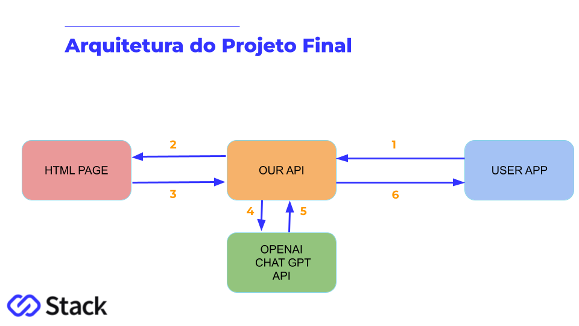
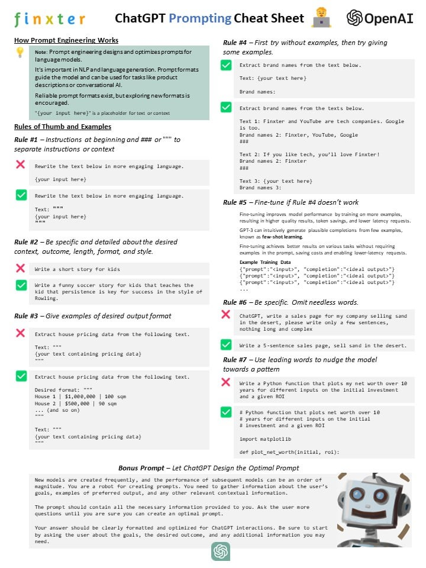

# Stack Academy

### [Técnicas Avançadas de NLP]

Link para Apresentação do Curso:

https://docs.google.com/presentation/d/1RDI18LsunTvxul9bzUGotfKLtBITDg-cACyaPEjwEQw/edit?usp=sharing

Link para os Notebooks das Aulas

https://colab.research.google.com/drive/1QN5gqDHMSO_upzMI3D-btjs43kE14PXy?usp=sharing

Link para obter API Key da OpenAI (Criar conta > clicar no icone da conta > view API keys > create new secret key)

https://platform.openai.com/

Link para obter API Key da Pinecone (Login > Conta Google > API keys > copy key and Enviroment)

https://app.pinecone.io/

Link para obter o access token da Huggin Face (Criar conta > clicar no icone da conta > settings > access tokens > copy WRITE)

https://huggingface.co/

Link para obter a API Key da SERP API (Criar conta > Your Account > Api Key > copy)

https://serpapi.com/

[objetivo do curso]

Natural Language Processing(NLP) é uma área de estudo que combina a ciência da computação, a linguística e a inteligência artificial para permitir que uma máquina possa entender automaticamente textos escritos ou falados pelos seres humanos. Neste curso vamos aprender e aplicar na prática os conceitos por trás das tarefas que podem ser realizadas utilizando NLP com Machine Learning  e Deep Learning. Conheceremos também as ferramentas, as principais bibliotecas e os modelos disponíveis no mercado, como BERT, Transformers, Hugging Faces, entre outras tecnologias. Os conhecimentos adquiridos nesta trilha de estudos são altamente valorizados no mercado de trabalho, especialmente em áreas como inteligência artificial, ciência de dados e análise de negócios.

- [**Fonte de Dados:** ]
  - Na pasta data encontra-se o HTML utilizado com ofornte de dados no Projeto do Assistente de Cursos  

[Para este projeto, foram usados as seguintes tecnologias: ]

- **NLP com Machine Learning  e Deep Learning. BERT, Transformers, Hugging Faces, Pinecone, Haystack, LangChain.**: Técnicas, ferramentas, bases vetoriais e frameworks utilizados nos códigos fontes do curso;
- **Github**: Controle do versionamento do código e repositório para armazenar os artefatos do curso para servir como portifolio;

[O projeto final foi organizados na seguinte arquitetura:] 

[Instruções para executar aplicação/projeto]

Setup do Ambiente da API

$ pip install -r requirements.txt

Copiar o arquivo .env.example para .env

$ cp .env.example .env

Editar o arquivo .env e incluir a sua OPENAI_API_KEY

$ cd api
$ uvicorn main:app --reload

Copiar a URL do Servidor da porta 8000 na aba PORTS

Atualizar a variavel API_URL no arquivo.env com a url copiada

Atualizar a variavel SITE_URL no arquivo.env com o site do curso que sera analisado

Abrir um novo terminal e depois entrar na pasta do streamlit

$ cd streamlit
$ streamlit run app.py

Acessar a documentacao da API: URL_do_servidor:8000/docs 

Acessar a aplicacao Streamlit: URL_do_servidor:8501

Temos os seguintes recursos GET disponíveis na API:
 
1. Realizar um resumo de uma URL específica na web

- http://URL_do_servidor:8000/summary?url=<SUA_URL>

2. Responder uma pergunta com base em uma URL específica na web

- http://URL_do_servidor:8000/answer?url=<SUA_URL>&question=<SUA_QUESTAO>

BÔNUS:

- [**Chat GPT Prompting Cheat Sheet** ]

